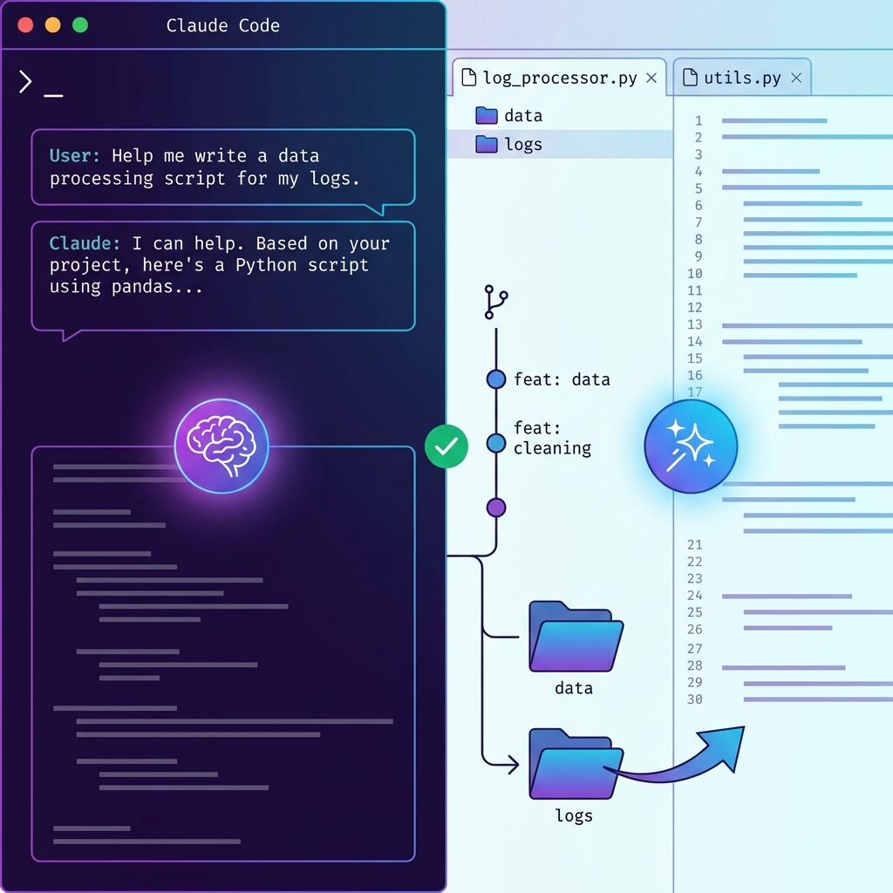
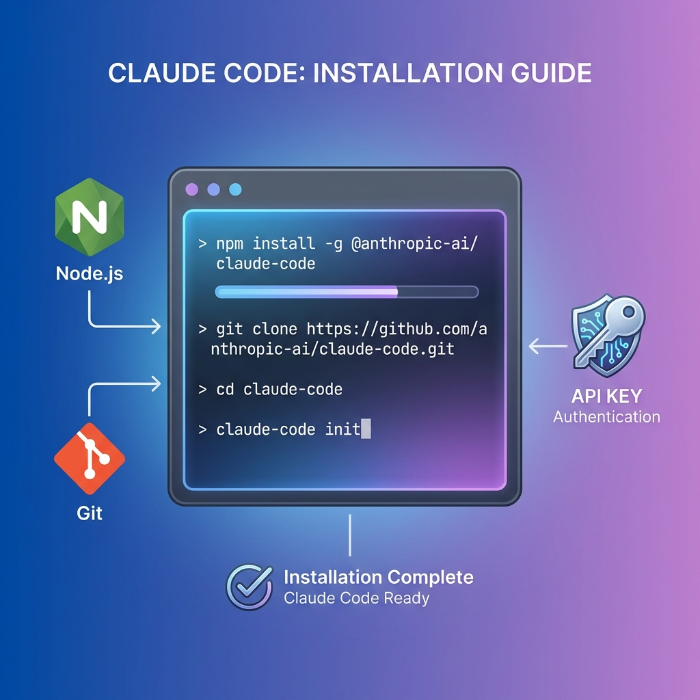

## 什么是 Claude Code？

**Claude Code** 是 Anthropic 开发的一款基于 Claude 4 模型的 AI 编程工具，它能够通过自然语言指令协助开发者处理编码任务、Git 工作流和调试。与传统的代码编辑器插件不同，Claude Code 是一个具有系统级权限的命令行工具（CLI），能够深度理解你的代码库并执行复杂的开发任务。


## 核心特性

Claude Code 作为新一代 AI 编程助手，拥有诸多令人印象深刻的能力：

### 1. **深度项目上下文理解**

Claude Code 具备高达 **200K token** 的上下文窗口，这意味着它可以：
- 理解整个项目的代码库结构
- 跟踪文件之间的依赖关系
- 在大型项目中保持上下文连贯性

### 2. **系统级 AI Agent**

与其他代码补全工具不同，Claude Code 拥有系统级权限，能够：
- 执行文件操作（创建、编辑、删除文件）
- 运行终端命令和脚本
- 管理进程和系统资源
- 自动化 Git 仓库管理

### 3. **多代理协作**

Claude Code 支持**子代理（Subagents）**并行处理复杂任务：
- 一个代理负责前端开发
- 另一个代理同时处理后端逻辑
- 实现真正的多任务并行开发

### 4. **视觉理解能力**

Claude Code 不仅能理解代码，还能分析图像：
- 分析 UI 设计图并生成代码
- 识别错误截图并提供解决方案
- 处理图表和数据可视化



## 安装与配置

### 系统要求

在安装 Claude Code 之前，请确保你的系统满足以下要求：

- **操作系统**：
  - macOS 10.15+ 
  - Ubuntu 20.04+ / Debian 10+
  - Windows 用户可通过 WSL 2 运行
- **必需软件**：
  - Node.js 18 或更高版本
  - Git 2.23 或更高版本
- **身份验证**：
  - Anthropic API Key 或账号订阅

### 安装步骤



#### 1. 安装 Node.js 和 Git

```bash
# macOS (使用 Homebrew)
brew install node git

# Ubuntu/Debian
sudo apt update
sudo apt install nodejs npm git
```

#### 2. 全局安装 Claude Code

```bash
npm install -g @anthropic-ai/claude-code
```

#### 3. 初始化配置

首次运行时，Claude Code 会引导你完成配置：

```bash
claude-code init
```

系统会提示你：
- 选择主题风格（暗色/亮色）
- 登录 Anthropic 账号
- 配置 API Key

## 基本使用

### 1. 启动命令行交互模式

在项目目录下运行：

```bash
claude
```

这将启动一个交互式会话，你可以开始与 Claude Code 对话。

### 2. 自然语言编程

你可以用自然语言描述你想要实现的功能：

```text
> 帮我创建一个 React 组件，用于展示用户列表，支持搜索和分页功能
```

Claude Code 会：
1. 分析你的项目结构
2. 创建必要的文件
3. 编写符合项目代码风格的代码
4. 自动导入依赖

### 3. 代码审查与重构

```text
> 审查 src/utils/api.js 文件，找出潜在的性能问题并优化
```

Claude Code 会：
- 分析代码逻辑
- 识别性能瓶颈
- 提供优化建议
- 自动重构代码

### 4. Git 工作流集成

```bash
# 生成符合规范的 commit message
claude commit

# 分析当前分支与主分支的差异
> 分析我这个分支相比 main 分支做了哪些改动

# 创建 Pull Request 描述
> 根据我的代码变更，生成一份详细的 PR 描述
```

### 5. 调试助手

当遇到错误时，你可以：

```text
> 我运行应用时遇到了这个错误：[粘贴错误信息]，帮我找出原因并修复
```

Claude Code 会：
1. 分析错误堆栈
2. 定位问题代码
3. 理解上下文
4. 提供修复方案并实施

## 进阶技巧

### 使用图像输入

Claude Code 支持多种方式输入图像：

```bash
# 方法 1: 拖放图像文件到终端
> 根据这个设计图实现页面布局 [拖入设计图]

# 方法 2: 粘贴剪贴板中的截图
> 分析这个错误截图 [Ctrl+V / Cmd+V]

# 方法 3: 提供文件路径
> 分析这张架构图：/path/to/diagram.png
```

### 多任务并行处理

对于复杂项目，你可以描述多个相关任务，Claude Code 会智能地分配子代理：

```text
> 我需要：
> 1. 重构用户认证模块
> 2. 为 API 添加单元测试
> 3. 更新相关文档
```

### 项目上下文管理

Claude Code 会自动跟踪项目上下文，但你也可以主动提供：

```text
> 项目背景：这是一个电商平台，使用 Next.js + TypeScript + PostgreSQL
> 现在帮我实现订单管理功能
```

## 实际应用场景

### 场景 1：快速原型开发

```text
> 帮我创建一个待办事项应用，包括：
> - 添加、删除、标记完成任务
> - 本地存储数据
> - 响应式设计
> 使用原生 HTML/CSS/JavaScript
```

### 场景 2：代码迁移

```text
> 将 src/components 目录下的所有 JavaScript 文件重写为 TypeScript
> 保持功能不变，添加适当的类型定义
```

### 场景 3：文档生成

```text
> 为 src/api 目录下的所有文件生成 JSDoc 注释
> 然后创建 API 文档的 markdown 文件
```

### 场景 4：性能优化

```text
> 分析整个项目，找出：
> 1. 可以做 code splitting 的地方
> 2. 未使用的依赖
> 3. 可以优化的数据库查询
```

## 与其他工具的对比

| 特性 | Claude Code | GitHub Copilot | Cursor |
| :--- | :--- | :--- | :--- |
| **上下文窗口** | 200K tokens | ~8K tokens | ~100K tokens |
| **系统级权限** | ✅ 是 | ❌ 否 | ⚠️ 部分 |
| **运行环境** | CLI + 桌面应用 | IDE 插件 | 独立编辑器 |
| **Git 集成** | ✅ 深度集成 | ⚠️ 基础支持 | ✅ 支持 |
| **多代理协作** | ✅ 是 | ❌ 否 | ❌ 否 |
| **视觉理解** | ✅ 是 | ❌ 否 | ✅ 是 |

## 最佳实践

### 1. **明确的指令**

❌ 不好的指令：
```text
> 改进这个文件
```

✅ 好的指令：
```text
> 重构 src/utils/format.js 文件：
> 1. 将函数拆分为更小的、单一职责的函数
> 2. 添加错误处理
> 3. 补充单元测试
> 4. 添加 JSDoc 注释
```

### 2. **提供上下文**

在处理复杂任务时，提供必要的背景信息：

```text
> 项目使用 React 18 + TypeScript + Material-UI
> 当前问题：表单验证不生效
> 相关文件：src/components/FormValidator.tsx
> 请帮我排查并修复
```

### 3. **迭代式开发**

利用 Claude Code 的对话能力，逐步完善功能：

```text
> 创建一个用户注册表单
# [Claude Code 生成代码]

> 很好，现在添加实时的表单验证
# [添加验证逻辑]

> 再加上密码强度指示器
# [继续完善]
```

### 4. **利用截图反馈**

开发 UI 时，可以截图给 Claude Code 查看效果：

```text
> 我实现了登录页面，截图如下 [粘贴截图]
> 请对比设计稿，找出差异并修复
```

## 注意事项与限制

1. **隐私考虑**：Claude Code 需要访问你的代码库，请确保遵守公司的安全政策
2. **网络依赖**：作为云端 AI，需要稳定的网络连接
3. **成本考虑**：根据使用量可能产生 API 费用
4. **代码审查**：AI 生成的代码仍需人工审查，确保质量和安全性

## 总结

Claude Code 代表了 AI 辅助编程的新方向。它不再是简单的代码补全工具，而是一个真正理解你的项目、能够执行复杂任务的智能编程伙伴。通过自然语言交互、深度项目理解和系统级操作能力，Claude Code 可以显著提升开发效率，让程序员专注于更高层次的架构设计和业务逻辑。

无论你是在快速原型开发、代码重构、还是处理遗留代码，Claude Code 都能成为你可靠的助手。随着 AI 技术的不断进步，这类工具将越来越成为现代开发者工具链中不可或缺的一部分。

---

**相关资源：**
- [Claude Code 官方文档](https://claude.ai/code)
- [Anthropic API 文档](https://docs.anthropic.com/)
- [GitHub 仓库](https://github.com/anthropic-ai/claude-code)
