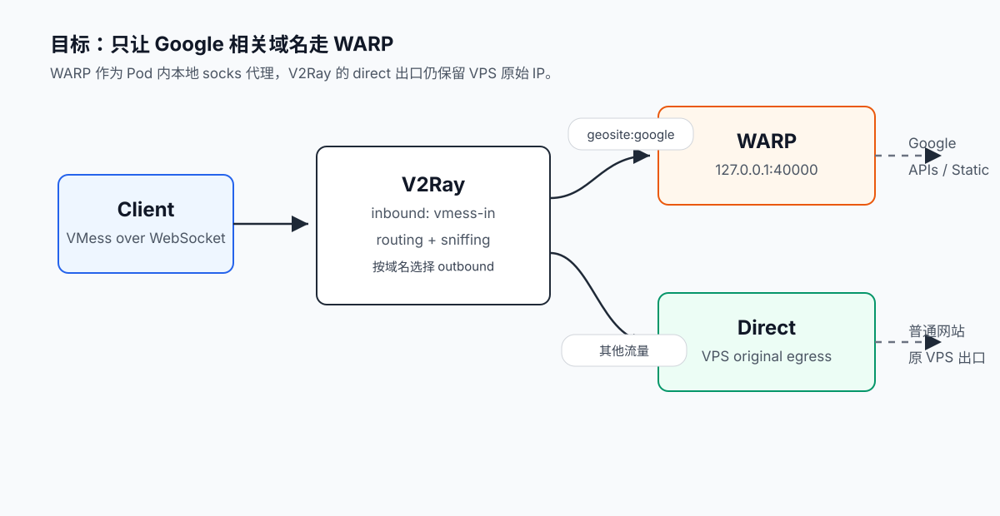
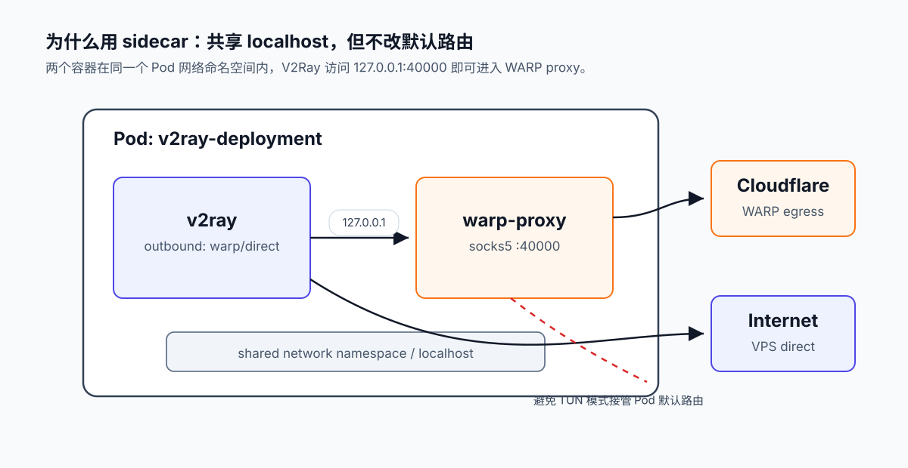
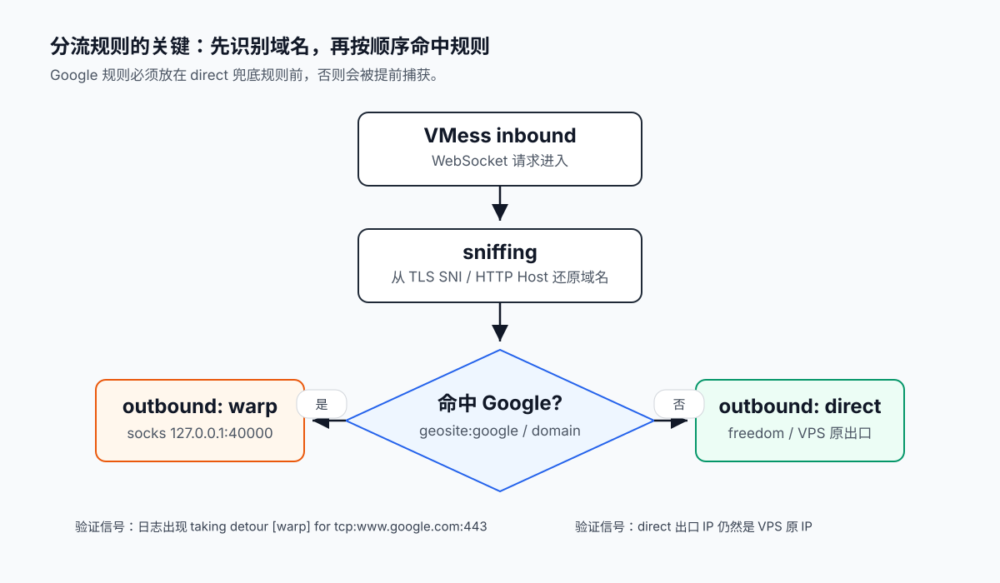
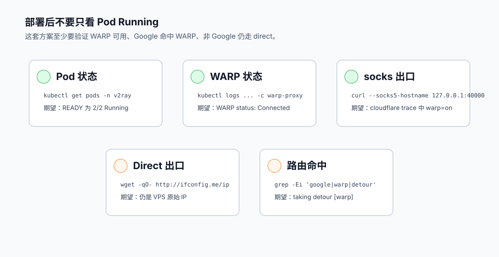

在 k3s 里跑 VMess 时，我希望只有 Google 相关域名走 Cloudflare WARP，其他网站仍然使用 VPS 原始出口。

关键点是：**不要让 WARP 以 TUN 模式接管整个 Pod 默认路由**。更可控的做法，是把 WARP 作为 V2Ray Pod 内的 socks sidecar，V2Ray 只有在 routing 命中 `warp` outbound 时才访问它。



## 架构

最终流量路径：

```text
Client
  |
  | VMess over WebSocket
  v
V2Ray inbound(vmess-in)
  |
  +-- Google domains --> outbound(warp)   --> 127.0.0.1:40000 --> WARP proxy
  |
  +-- Other traffic  --> outbound(direct) --> VPS original IP
```

示例环境：

```text
namespace: v2ray
deployment: v2ray-deployment
configmap: v2ray-config
v2ray image: teddysun/v2ray:5.41.0
warp image: seiry/cloudflare-warp-proxy:latest
```

Pod 内多个容器共享同一个网络命名空间，所以 V2Ray 可以直接访问 `warp-proxy` 监听的 `127.0.0.1:40000`。这样不需要额外维护 Service，也减少了集群 DNS 或 ClusterIP 异常对关键路径的影响。



## 1. 增加 WARP sidecar

给已有 V2Ray Deployment 增加一个 `warp-proxy` 容器：

```bash
kubectl patch deployment v2ray-deployment -n v2ray --type=json -p='[
  {
    "op": "add",
    "path": "/spec/template/spec/containers/-",
    "value": {
      "name": "warp-proxy",
      "image": "seiry/cloudflare-warp-proxy:latest",
      "imagePullPolicy": "Always",
      "ports": [
        {
          "name": "socks5",
          "containerPort": 40000,
          "protocol": "TCP"
        }
      ],
      "resources": {
        "requests": {
          "cpu": "100m",
          "memory": "128Mi"
        },
        "limits": {
          "cpu": "500m",
          "memory": "512Mi"
        }
      }
    }
  }
]'
```

## 2. 配置 V2Ray outbound

在 V2Ray 配置中增加一个 socks outbound，指向本地 WARP proxy，同时保留 direct：

```json
{
  "outbounds": [
    {
      "tag": "warp",
      "protocol": "socks",
      "settings": {
        "servers": [
          {
            "address": "127.0.0.1",
            "port": 40000
          }
        ]
      }
    },
    {
      "tag": "direct",
      "protocol": "freedom",
      "settings": {}
    },
    {
      "tag": "blocked",
      "protocol": "blackhole",
      "settings": {}
    }
  ]
}
```

## 3. 开启 sniffing

建议在 VMess inbound 中开启 TLS/HTTP sniffing：

```json
{
  "sniffing": {
    "enabled": true,
    "destOverride": ["http", "tls"]
  }
}
```

客户端可能已经把域名解析成 IP 后再发给 VMess。开启 sniffing 后，服务端可以从 TLS SNI 或 HTTP Host 中识别真实域名，从而稳定命中 Google 分流规则。

## 4. 配置 Google 分流规则

V2Ray routing 是顺序匹配，Google 规则必须放在 `direct` 兜底规则之前：



```json
{
  "routing": {
    "domainStrategy": "IPIfNonMatch",
    "rules": [
      {
        "type": "field",
        "domain": [
          "geosite:google",
          "domain:google.com",
          "domain:googleapis.com",
          "domain:googleusercontent.com",
          "domain:gstatic.com",
          "domain:ggpht.com"
        ],
        "outboundTag": "warp"
      },
      {
        "type": "field",
        "inboundTag": ["vmess-in"],
        "outboundTag": "direct"
      }
    ]
  }
}
```

## 5. 应用并验证

修改 ConfigMap 后重启 Deployment：

```bash
kubectl rollout restart deployment/v2ray-deployment -n v2ray
kubectl rollout status deployment/v2ray-deployment -n v2ray --timeout=180s
```

确认 Pod 已经变成 `2/2 Running`：

```bash
kubectl get pods -n v2ray -l app=v2ray -o wide
```

查看容器列表：

```bash
kubectl get deployment -n v2ray v2ray-deployment \
  -o jsonpath='{range .spec.template.spec.containers[*]}{.name}{" image="}{.image}{"\n"}{end}'
```

期望看到：

```text
v2ray image=teddysun/v2ray:5.41.0
warp-proxy image=seiry/cloudflare-warp-proxy:latest
```

然后验证 WARP proxy：

```bash
kubectl logs -n v2ray deployment/v2ray-deployment -c warp-proxy --tail=80
```

正常日志中应出现：

```text
WARP status: Connected { network_health: NetworkHealthy, ... }
```

从 Pod 内测试 socks：

```bash
POD=$(kubectl get pod -n v2ray -l app=v2ray -o jsonpath='{.items[0].metadata.name}')

kubectl debug -n v2ray -it "$POD" \
  --image=curlimages/curl:8.10.1 \
  --target=v2ray -- \
  sh -c 'curl -sS --max-time 20 --socks5-hostname 127.0.0.1:40000 https://www.cloudflare.com/cdn-cgi/trace | grep -E "^(ip|warp)="'
```

期望输出：

```text
ip=104.28.xxx.xxx
warp=on
```

## 6. 检查 direct 没有被污染

直接在 V2Ray 容器里查出口 IP：

```bash
kubectl exec -n v2ray deployment/v2ray-deployment -c v2ray -- \
  sh -c 'wget -qO- --timeout=10 http://ifconfig.me/ip 2>/dev/null || true'
```

期望结果应该是 VPS 原 IP，而不是 Cloudflare/WARP IP。如果这里已经变成 WARP IP，说明 WARP sidecar 仍然接管了整个 Pod 默认路由。

## 7. 确认分流命中

临时把 V2Ray 日志级别调成 `debug`，通过客户端访问：

```text
https://www.google.com/generate_204
```

查看日志：

```bash
kubectl exec -n v2ray deployment/v2ray-deployment -c v2ray -- \
  sh -c 'tail -300 /var/log/v2ray/access.log 2>/dev/null; tail -300 /var/log/v2ray/error.log 2>/dev/null' \
  | grep -Ei 'google|warp|sniff|detour'
```

期望看到类似：

```text
accepted tcp:www.google.com:443 [warp]
app/dispatcher: sniffed domain: www.google.com for tcp:www.google.com:443
app/dispatcher: taking detour [warp] for [tcp:www.google.com:443]
```

验证完成后，把日志级别恢复成 `warning`。



## 常见坑

- **TUN sidecar 接管默认路由**：会导致 `direct` outbound 也变成 WARP 出口。
- **Google 规则顺序错误**：如果 direct 兜底规则排在前面，Google 流量会先被 direct 捕获。
- **未开启 sniffing**：服务端只看到 IP 时，`geosite:google` 或 `domain:google.com` 不一定能稳定命中。
- **依赖 Service/DNS 做关键路径**：同 Pod sidecar 使用 `127.0.0.1`，可以绕开集群 DNS 或 ClusterIP 的额外变量。

## 总结

这套方案的核心只有两点：

1. V2Ray 的 `warp` outbound 指向 `127.0.0.1:40000`。
2. routing 中将 Google 域名导向 `warp`，其他流量导向 `direct`。

配合 VMess inbound 的 sniffing，可以稳定实现：

```text
Google -> WARP
Others -> VPS direct
```
